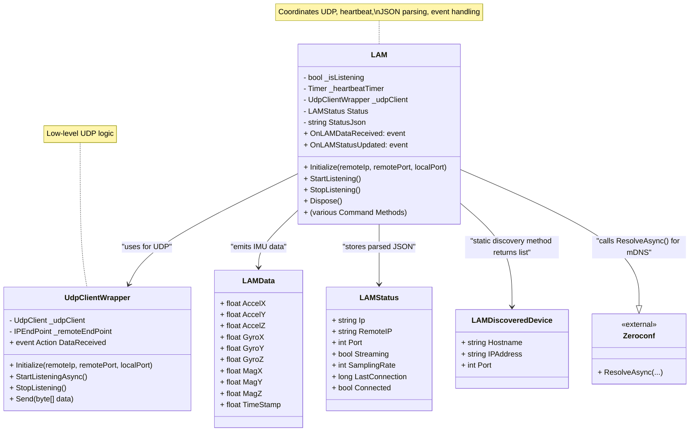
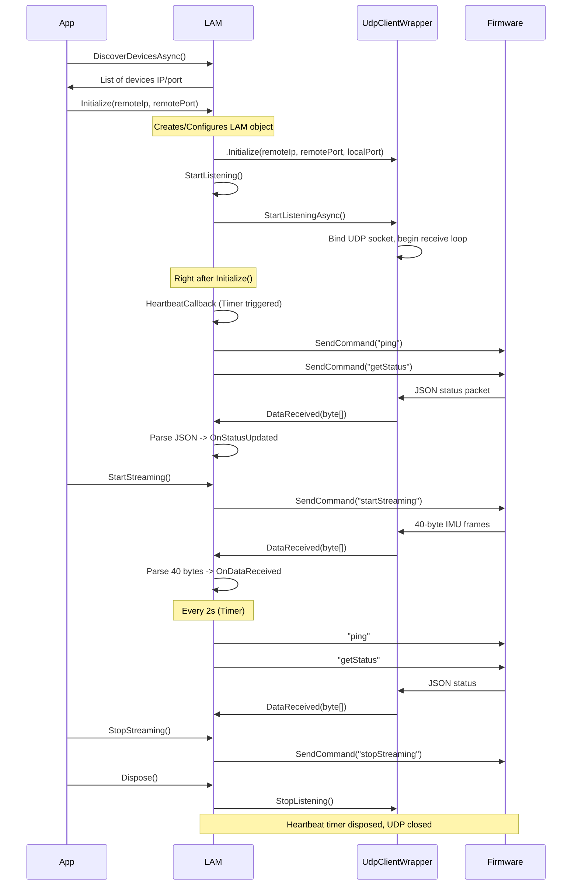

# C# LAM SDK Documentation

This document covers the usage of the LAM SDK, describing its structure and functionality for communicating with LAM-enabled devices via UDP. The SDK supports tasks such as discovering devices, managing connection states, and handling incoming data.

## Folder Structure

```plaintext
├── Core
│   └── UdpClientWrapper.cs
├── Exceptions
│   └── LAMException.cs
├── LAM.cs
└── Models
    ├── LAMData.cs
    └── LAMStatus.cs
```

## Overview

The LAM SDK is a C# library designed to communicate with an ESP32-based IMU device, referred to as the "LAM device", over UDP. This device:

- Streams IMU data (Accelerometer, Gyroscope, Magnetometer, plus a timestamp).
- Provides a JSON-based status (including IP, streaming state, sampling rate, etc.).
- Supports mDNS (Zeroconf) discovery for finding devices automatically on the local network.
- Handles heartbeats to maintain and detect connectivity.

By integrating the LAM SDK into a C# application, you can:

- Discover devices using mDNS.
- Initialize a UDP connection to a target device.
- Send commands (e.g., `startStreaming`, `stopStreaming`, `getStatus`, `ping`, etc.).
- Receive real-time IMU data.
- Monitor device status in JSON form.

## Class Diagram


## Class Diagram Details
### LAM

 - Orchestrates the SDK’s functionality, including initializing UDP, listening, sending commands, heartbeats, and events.
 - Publishes OnLAMDataReceived (for IMU frames) and OnLAMStatusUpdated (for JSON status).

### UdpClientWrapper

 - Encapsulates low-level UDP operations (initializing sockets, sending/receiving packets).
 - Raises DataReceived whenever a packet arrives, which LAM subscribes to.

### LAMData

 - Represents a single IMU frame (40 bytes → 10 floats: Accel, Gyro, Mag placeholders, and Timestamp).

### LAMStatus

 - Holds the parsed JSON fields from the device’s status messages.
### LAMDiscoveredDevice

 - Simple model class returned by DiscoverDevicesAsync. Contains a device’s hostname/IP/port.

### Zeroconf

 - External library for mDNS.
 - Used by LAM.DiscoverDevicesAsync to scan the network for _imu._udp.local. services.
 

## SDK Requirements

- .NET 6 (or higher) is recommended.
- Zeroconf NuGet Package for mDNS discovery.
- System.Text.Json (or Newtonsoft.Json) for JSON parsing.
- A UDP-capable network environment where the LAM device and your PC are on the same local network.

## SDK Installation

### Obtain the SDK Files

The SDK typically consists of:

- `LAM.cs`
- `LAMData.cs` (model for IMU frames)
- `LAMStatus.cs` (model for JSON status)
- `LAMDiscoveredDevice.cs` (model for discovered devices, if separate)
- `UdpClientWrapper.cs` (a simple class to manage UDP connections)

### Add Zeroconf

```shell
PM> Install-Package Zeroconf
```

### (Optionally) Configure JSON

If you wish to parse the device status as a strongly typed C# object, ensure you have references to `System.Text.Json` (built into .NET Core/6+).

## Flow Overview (App<->SDK<->Device)


## Getting Started

### 1. Discover Devices (mDNS)

Use `LAM.DiscoverDevicesAsync("_imu._udp.local.")` to find devices advertising the `_imu._udp` service on your network:

```csharp
var devices = await LAM.DiscoverDevicesAsync(); // "_imu._udp.local." is the default for this SDK
if (devices.Count == 0) {
    Console.WriteLine("No devices found via mDNS.");
    return;
}
foreach (var dev in devices) {
    Console.WriteLine($"Found: Host={dev.Hostname}, IP={dev.IPAddress}, Port={dev.Port}");
}
```

### 2. Create and Initialize

Pick a discovered device (or specify IP/port manually) and create a LAM instance:

```csharp
var lam = new LAM();
lam.Initialize(devices[0].IPAddress, devices[0].Port);
```

#### `Initialize()`:
- Sets up the UDP connection.
- Starts listening for incoming packets.
- Sends a heartbeat ("ping") and requests status ("getStatus").
- Schedules a recurring heartbeat every 8 seconds to keep the device connection alive.

### 3. Subscribe to Events

```csharp
lam.OnDataReceived += (imuFrame) => {
    Console.WriteLine("IMU => " +
        $"A=({imuFrame.AccelX:F2}, {imuFrame.AccelY:F2}, {imuFrame.AccelZ:F2}), " +
        $"G=({imuFrame.GyroX:F2}, {imuFrame.GyroY:F2}, {imuFrame.GyroZ:F2}), " +
        $"Timestamp={imuFrame.TimeStamp}");
};

lam.OnStatusUpdated += (json) => {
    Console.WriteLine($"Status Update: {json}");
    if (lam.Status != null) {
        Console.WriteLine($"Connected: {lam.Status.Connected}, Streaming: {lam.Status.Streaming}");
    }
};
```

### 4. Issue Commands

The LAM device firmware supports specific text commands. The SDK has convenience methods:

- `StartStreaming()`
- `StopStreaming()`
- `SetSamplingRate(int rate)`
- `EnableAxes(bool x, bool y, bool z)`
- `SendHeartbeat()` (rarely needed manually due to automatic timer)
- `GetStatus()`

Example:

```csharp
lam.SetSamplingRate(100);
lam.StartStreaming();
```

### 5. Receiving IMU Data

When streaming is active, the device sends 40-byte packets, which represent 10 floats:

- `[0..2]: Accelerometer (X, Y, Z)`
- `[3..5]: Gyroscope (X, Y, Z)`
- `[6..8]: Magnetometer placeholders (X, Y, Z)`
- `[9]: Timestamp (milliseconds)`

The SDK's `ParseLAMData()` method decodes these bytes into a `LAMData` object:

```csharp
public class LAMData {
    public float AccelX { get; set; }
    public float AccelY { get; set; }
    public float AccelZ { get; set; }
    public float GyroX { get; set; }
    public float GyroY { get; set; }
    public float GyroZ { get; set; }
    public float MagX { get; set; }
    public float MagY { get; set; }
    public float MagZ { get; set; }
    public float TimeStamp { get; set; }
}
```

### 6. Handling Status Updates

When the incoming data is not 40 bytes, it's assumed to be JSON status data. The SDK attempts to parse it into `LAMStatus`. If successful, it’s stored in `lam.Status`:

```csharp
public class LAMStatus {
    public string Ip { get; set; }
    public string RemoteIP { get; set; }
    public int Port { get; set; }
    public bool Streaming { get; set; }
    public int SamplingRate { get; set; }
    public long LastConnection { get; set; }
    public bool Connected { get; set; }
}
```

The JSON is also accessible as a raw string in `lam.StatusJson`.

## Heartbeat Logic

- By default, every 8 seconds, the SDK calls `SendCommand("ping")` and `GetStatus()`.
- The ESP32 sets `connectedToCSharpApp = true` upon receiving "ping".
- If `LastConnection` (from the device) or a local timestamp is out-of-date, the SDK might mark the device as disconnected.

## Cleanup

Once you’re finished:

```csharp
lam.StopStreaming();
lam.Dispose();
```

`Dispose()` stops the listening socket and kills the heartbeat timer.

## Example Full Program

```csharp
using System;
using System.Threading.Tasks;

namespace LAM_SDK_Example {
    class Program {
        static async Task Main(string[] args) {
            // 1. Discover via mDNS
            var devices = await LAM.DiscoverDevicesAsync("_imu._udp.local.");
            if (devices.Count == 0) {
                Console.WriteLine("No devices found.");
                return;
            }

            // 2. Create the LAM object
            var lam = new LAM();

            // 3. Subscribe to events
            lam.OnDataReceived += (data) => {
                Console.WriteLine($"[IMU] Acc=({data.AccelX:F2}, {data.AccelY:F2}, {data.AccelZ:F2}), Ts={data.TimeStamp}");
            };
            lam.OnStatusUpdated += (json) => {
                Console.WriteLine($"[Status] {json}");
                if (lam.Status != null) {
                    Console.WriteLine($"Streaming={lam.Status.Streaming}, Connected={lam.Status.Connected}");
                }
            };

            // 4. Initialize => sets up UDP, starts listening, sends heartbeat & getStatus
            lam.Initialize(devices[0].IPAddress, devices[0].Port);

            // 5. Start streaming
            lam.StartStreaming();

            Console.WriteLine("Press ENTER to stop...");
            Console.ReadLine();

            // 6. Cleanup
            lam.StopStreaming();
            lam.Dispose();
        }
    }
}
```


## Troubleshooting & FAQ

### No devices found via mDNS
- Ensure your PC and device are on the same subnet.
- Check that the device calls `MDNS.addService("_imu", "udp", 5000);` in its firmware.
- On Windows, confirm that you have Bonjour or a similar mDNS service installed, or that your environment supports `.local` resolution.

### IMU data not received
- Make sure you called `StartStreaming()` or `SetSamplingRate()`.
- Confirm your firewall or antivirus allows inbound UDP on the local port.
- Verify the device logs show IMU streaming started.

### Device Marked Disconnected
- The heartbeat is sent every 8s. If the device firmware doesn’t respond or update `LastConnection`, the SDK might mark it as disconnected. Check the device logs for issues.

### Still need a manual heartbeat?
- Typically not; the SDK’s Timer sends "ping" automatically. However, you can call `SendHeartbeat()` yourself if needed.

### JSON Parsing Fails
- If the device’s status message changes or includes new fields, adjust the `LAMStatus` model. Or just rely on `OnStatusUpdated` (raw JSON) for custom parsing.


## Redistribution Guide

When redistributing a project that utilizes the LAM SDK, it is crucial to ensure that all necessary files and dependencies are packaged correctly.

### Redistribution Checklist

#### Include the SDK Files

- **Add `LAM_SDK.dll`**: Ensure that the LAM SDK library is included in your project output.
- **Include the `.deps.json` file**: This file should reside in the same directory as your executable to resolve dependencies correctly.

#### Include Dependencies

- **Verify SDK Dependencies**: Use NuGet to resolve all SDK dependencies such as Zeroconf. Confirm these are included in your project.

#### Publish Your Project

Use the `dotnet publish` command or Visual Studio to create a redistributable version of your application:

```bash
dotnet publish -c Release -r win-x64 --self-contained false
```

This command ensures all required DLLs are included in the output folder.

#### Distribute Runtime Prerequisites

- Ensure that the target machine has the necessary .NET Runtime installed, such as .NET 6.
- For projects that do not require a pre-installed runtime on the target machine, distribute a self-contained version of your app:

```bash
dotnet publish -c Release -r win-x64 --self-contained true
```

#### Document the Installation Process

Provide users with clear instructions on how to run the application and any prerequisites, such as network configuration and mDNS availability.

### Example Redistribution Folder Structure

Below is an example of how your output directory structure might look:

```bash
/MyLamApp
├── MyLamApp.exe           # Your application executable
├── MyLamApp.deps.json     # Dependency file
├── LAM_SDK.dll            # LAM SDK library
├── Zeroconf.dll           # Zeroconf dependency (if required)
├── System.Text.Json.dll   # JSON dependency (if required)
└── README.txt             # Documentation for your app
```

### Best Practices

- **Testing**: Test your distributed application on a clean machine to ensure all required files are included.
- **Documentation**: Provide clear documentation to users, including prerequisites (e.g., .NET runtime) and usage instructions.
- **Version Control**: Use versioned filenames for the SDK (e.g., `LAM_SDK_v1.0.0.dll`) to track updates and ensure compatibility.

### Additional Notes

- If you are using mDNS, ensure that the target network supports multicast traffic for device discovery.
- When deploying to a Windows environment, confirm that Bonjour or a similar mDNS resolver is installed to support mDNS functionality.
- For more advanced deployment options, consider using tools like WiX or Inno Setup to create an installer that simplifies installation for end users.


# ESP32 LAM Device Firmware (example)

```c
#include <WiFi.h>
#include <WiFiUdp.h>
#include <Wire.h>
#include <ESPmDNS.h>  // For mDNS support
#include "MPU6050.h"

// ----------------------------------------------------------------------------
// Wi-Fi Credentials
// ----------------------------------------------------------------------------
const char* ssid     = "YOUR_WIFI_SSID";
const char* password = "YOUR_WIFI_PASSWORD";

// ----------------------------------------------------------------------------
// UDP
// ----------------------------------------------------------------------------
WiFiUDP udp;
IPAddress remoteIP;           // Stores the IP of the PC sending commands
unsigned int remotePort = 0;  // Stores the port of the PC

const unsigned int LISTEN_PORT = 5000;        // Port to listen for commands
const unsigned long HEARTBEAT_TIMEOUT = 10000; // 10 seconds timeout for heartbeat

// ----------------------------------------------------------------------------
// IMU
// ----------------------------------------------------------------------------
MPU6050 imu;
static const int I2C_SDA = 14;
static const int I2C_SCL = 15;

// mDNS
const char* mDNS_hostname = "thrombus-lam"; // maybe -left or -right depending on the leg?
const char* mDNS_service = "_imu"; // **needs to start with _   // in case a device exposes more than 1 services under different or same port (e.g imu data, ppg data, )

// Streaming & config
bool streaming = false;   
int samplingRate = 30;   
bool enableAccel[3] = { true, true, true };
bool enableGyro[3]  = { true, true, true };
bool enableMag[3]   = { false, false, false }; 

// Timestamps & connection
unsigned long lastSampleTime    = 0;           // For sampling rate
unsigned long lastHeartbeatTime = 0;           // Last time a heartbeat was received
bool connected       = false;       // Connection state

// ----------------------------------------------------------------------------
// Function Prototypes
// ----------------------------------------------------------------------------
void setupMDNS();
void processCommand(const String& cmd);
void sendIMUData();
void sendStatus();
void handleHeartbeat();
void resumeAdvertising();

// ----------------------------------------------------------------------------
// Setup
// ----------------------------------------------------------------------------
void setup() {
  Serial.begin(115200);
  delay(1000);

  // 1. Connect to Wi-Fi
  WiFi.begin(ssid, password);
  Serial.print("Connecting to Wi-Fi");
  while (WiFi.status() != WL_CONNECTED) {
    delay(500);
    Serial.print(".");
  }
  Serial.println("\nWi-Fi connected. IP address: " + WiFi.localIP().toString());

  // 2. Initialize mDNS
  setupMDNS();

  // 3. Start UDP listener
  udp.begin(LISTEN_PORT);
  Serial.println("UDP listening on port " + String(LISTEN_PORT));

  // 4. Initialize IMU
  Wire.begin(I2C_SDA, I2C_SCL);
  imu.initialize();
  if (!imu.testConnection()) {
    Serial.println("MPU6050 connection failed!");
  } else {
    Serial.println("MPU6050 connected!");
  }
}

// ----------------------------------------------------------------------------
// Main Loop
// ----------------------------------------------------------------------------
void loop() {
  // 1. Check for incoming UDP packets
  int packetSize = udp.parsePacket();
  if (packetSize) {
    remoteIP   = udp.remoteIP();
    remotePort = udp.remotePort();

    char packetBuffer[128];
    int len = udp.read(packetBuffer, sizeof(packetBuffer) - 1);
    packetBuffer[len] = 0;
    String cmd = String(packetBuffer);

    Serial.println("Received Command: " + cmd);

    if (cmd == "ping") {
      // Handle heartbeat
      handleHeartbeat();
    } else {
      // Process other commands
      processCommand(cmd);
    }
  }

  // 2. If streaming, send IMU data at the specified rate
  unsigned long currentTime = millis();
  unsigned long interval    = 1000UL / samplingRate;
  if (streaming && (currentTime - lastSampleTime >= interval)) {
    lastSampleTime = currentTime;
    sendIMUData();
  }

  // 3. Check heartbeat timeout
  if (connected && (millis() - lastHeartbeatTime > HEARTBEAT_TIMEOUT)) {
    Serial.println("Heartbeat timeout. Disconnected.");
    connected = false;
    resumeAdvertising();
  }

}

// ----------------------------------------------------------------------------
// mDNS Setup
// ----------------------------------------------------------------------------
void setupMDNS() {
  if (!MDNS.begin(mDNS_hostname)) {
    Serial.println("Error setting up mDNS responder!");
  } else {
    Serial.println("mDNS responder started. Hostname: " + String(mDNS_hostname) + ".local");
    // Advertise a service so the C# app can discover via Zeroconf if needed
    MDNS.addService(mDNS_service, "_udp", LISTEN_PORT);
  }
}

// ----------------------------------------------------------------------------
// Resume Advertising
// ----------------------------------------------------------------------------
void resumeAdvertising() {
  Serial.println("Resuming mDNS advertising...");
  MDNS.addService(mDNS_service, "_udp", LISTEN_PORT);
}

// ----------------------------------------------------------------------------
// Handle Heartbeat
// ----------------------------------------------------------------------------
void handleHeartbeat() {
  lastHeartbeatTime = millis();
  if (!connected) {
    Serial.println("Connected to C# app via heartbeat.");
    connected = true;
    // Stop advertising to reduce network traffic
    mdns_service_remove(mDNS_service, "_udp");
  }
}

// ----------------------------------------------------------------------------
// Command Processor
// ----------------------------------------------------------------------------
void processCommand(const String& cmd) {
  if (cmd == "initialize") {
    Serial.println("Initialized IMU module");

  } else if (cmd.startsWith("setSamplingRate:")) {
    String rateStr = cmd.substring(strlen("setSamplingRate:"));
    samplingRate   = rateStr.toInt();
    Serial.println("Set sampling rate to " + String(samplingRate) + " Hz");

  } else if (cmd == "startStreaming") {
    streaming = true;
    Serial.println("IMU streaming started");

  } else if (cmd == "stopStreaming") {
    streaming = false;
    Serial.println("IMU streaming stopped");

  } else if (cmd == "getStatus") {
    sendStatus();

  } else {
    Serial.println("Unknown command: " + cmd);
  }
}

// ----------------------------------------------------------------------------
// Send IMU Data (10 floats: 9 sensor + 1 timestamp)
// ----------------------------------------------------------------------------
void sendIMUData() {
  int16_t ax, ay, az, gx, gy, gz;
  imu.getMotion6(&ax, &ay, &az, &gx, &gy, &gz);

  // Convert raw to floats
  float accelX = float(ax) / 16384.0f;
  float accelY = float(ay) / 16384.0f;
  float accelZ = float(az) / 16384.0f;
  float gyroX  = float(gx) / 131.0f;
  float gyroY  = float(gy) / 131.0f;
  float gyroZ  = float(gz) / 131.0f;

  // Magnetometer placeholders
  float magX = 0.0f;
  float magY = 0.0f;
  float magZ = 0.0f;

  // Timestamp in ms (converted to float)
  float timestampMs = (float)millis();

  // Build the binary payload: 10 floats => 40 bytes
  // [0..8] = sensor data, [9] = timestamp
  float data[10];
  data[0] = enableAccel[0] ? accelX : 0.0f;
  data[1] = enableAccel[1] ? accelY : 0.0f;
  data[2] = enableAccel[2] ? accelZ : 0.0f;
  data[3] = enableGyro[0]  ? gyroX  : 0.0f;
  data[4] = enableGyro[1]  ? gyroY  : 0.0f;
  data[5] = enableGyro[2]  ? gyroZ  : 0.0f;
  data[6] = enableMag[0]   ? magX   : 0.0f;
  data[7] = enableMag[1]   ? magY   : 0.0f;
  data[8] = enableMag[2]   ? magZ   : 0.0f;
  data[9] = timestampMs; 

  // Send over UDP
  udp.beginPacket(remoteIP, remotePort);
  udp.write((uint8_t*)data, sizeof(data));
  udp.endPacket();
}

// ----------------------------------------------------------------------------
// Send Status (as JSON)
// ----------------------------------------------------------------------------
void sendStatus() {
  // Time since last heartbeat
  unsigned long timeSinceHeartbeat = millis() - lastHeartbeatTime;

  // Build a JSON string containing config/state
  // Example structure:
  // {
  //   "ip": "192.168.1.50",
  //   "port": 5000,
  //   "streaming": true,
  //   "samplingRate": 100,
  //   "lastConnection": 1234,  // ms since last heartbeat
  //   "connected": true
  // }

  String ipStr = WiFi.localIP().toString();
  String remoteIPStr = connected ? remoteIP.toString() : "";
  
  String statusMsg = "{";
  statusMsg += "\"ip\":\"" + ipStr + "\",";
  statusMsg += "\"remoteIP\":\"" + remoteIPStr + "\",";
  statusMsg += "\"port\":" + String(remotePort) + ",";
  statusMsg += "\"streaming\":" + String((streaming ? "true" : "false")) + ",";
  statusMsg += "\"samplingRate\":" + String(samplingRate) + ",";
  statusMsg += "\"lastConnection\":" + String(timeSinceHeartbeat) + ",";
  statusMsg += "\"connected\":" + String((connected ? "true" : "false"));
  statusMsg += "}";

  // Send over UDP
  udp.beginPacket(remoteIP, remotePort);
  udp.print(statusMsg);
  udp.endPacket();

  Serial.println("Sent status: " + statusMsg);
}


```
